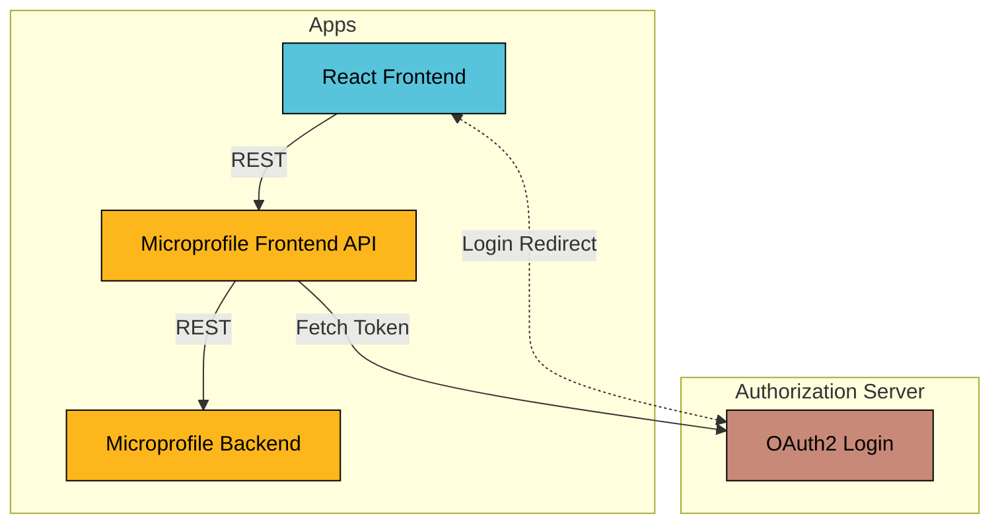

# Microprofile OAuth2 Token Relay

This example shows how to secure a React frontend and Microprofile REST API using OAuth2.

It uses the OAuth2 Authorization Code Grant (RFC6749 section 4.1) login flow to authenticate the end users.

## Prerequisites

* Java Runtime - e.g. [Temurin JDK](https://adoptium.net) or [OpenJDK](https://openjdk.org)
* [NodeJS Runtime](https://nodejs.org)
* [NPM](https://www.npmjs.com) or [Yarn](https://yarnpkg.com)

## Run

Start the Backend application:
```bash
../../gradlew :apps:microprofile-api-rest:backend:libertyDev
```

Start the Frontend API application:

```bash
../../gradlew :apps:microprofile-api-rest:frontend-api:libertyDev
```

Start the Frontend application (this should open a browser window):
```bash
yarn --cwd ./frontend install
yarn --cwd ./frontend start
```

## Architecture



### Authorization Server

The Authorization Server is an OAuth2 Authorization Server application based on Spring Boot and the
[spring-security-oauth2-authorization-server](https://spring.io/projects/spring-authorization-server) project.

This Spring Boot application is configured using the simplest setup with only in-memory storage. This is for simplicity
reasons as the main focus of this example is to show how to implement the Frontend and Frontend API applications.

Look at the `application.yml` files for more details on the security configuration.

### Backend

The Backend is a REST API application based on Microprofile.

### Frontend API

The Frontend API is a REST API application based on Microprofile.

### Frontend

The Frontend is a JavaScript web application based on ReactJS and using the React Bootstrap framework.
