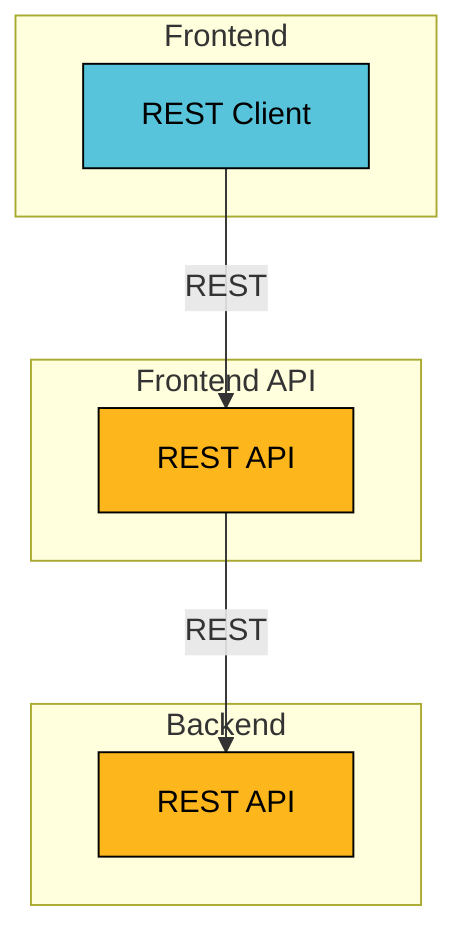

# Ktor CRUD Exposed

This example shows a React frontend and Microprofile REST API.

## Prerequisites

* Java Runtime - e.g. [Temurin JDK](https://adoptium.net) or [OpenJDK](https://openjdk.org)
* [NodeJS Runtime](https://nodejs.org)
* [NPM](https://www.npmjs.com) or [Yarn](https://yarnpkg.com)

## Run

Start Backend application:
```bash
../../gradlew :apps:microprofile-api-rest:backend:run
```

Start Frontend API application:

```bash
../../gradlew :apps:microprofile-api-rest:frontend-api:run
```

Start Frontend application (this should open a browser window):
```bash
yarn --cwd ./frontend install
yarn --cwd ./frontend start
```

## Architecture



### Backend

The Backend is a REST API application based on Microprofile.

### Frontend API

The Frontend API is a REST API application based on Microprofile.

### Frontend

The Frontend is a JavaScript web application based on ReactJS and using the React Bootstrap framework.
