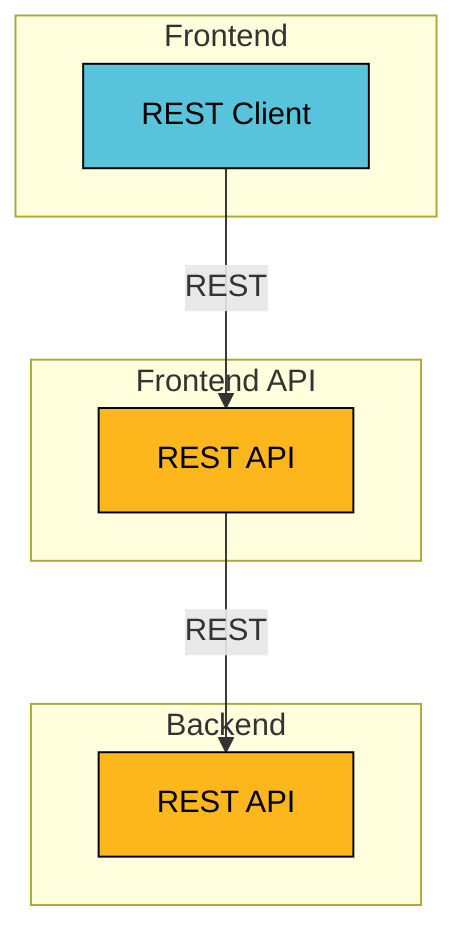

# Ktor CRUD Exposed

This example shows a React frontend and Microprofile REST API.

## Architecture

The example consists of a `Frontend` and a `Backend` application.

The `Frontend` application communicates with the `Backend` application using REST.
